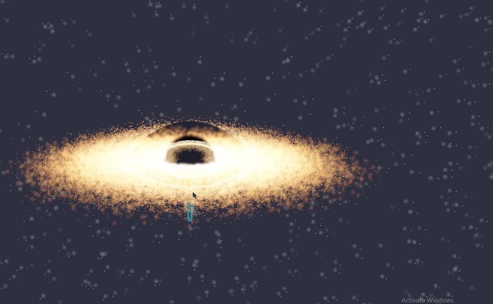

# 🌌 Incursion: A Blackhole effect and BigBang simulation

[](https://www.python.org/)
[](https://www.opengl.org/)
[](LICENSE)

A high-fidelity Python + OpenGL 3.3 Core Profile simulation engine modeling general relativity visual phenomena, accretion disk dynamics, N-body gravity orbital mechanics, space-time grid deformation, and an 18-phase cosmic lifecycle from gravitational collapse to universe rebirth.

---

## 🎬 Project Preview

### 🖼️ Simulator Screenshot


### 📹 Simulation Demo
<p align="center">
  <video src="Incursion_Demo.mp4" width="100%" controls loop muted></video>
</p>

---
## 👥 Team Project & My Contributions

This repository is a fork of the original team project developed collaboratively by multiple contributors for an academic purpose. My primary responsibilities in the project included:

### Physics Implementation
- Implemented and refined core physics algorithms for gravitational interactions.
- Contributed to the N-body gravitational simulation using Velocity Verlet integration.
- Assisted in developing orbital mechanics, gravitational collapse behavior, and black hole interaction logic.
- Participated in testing and tuning simulation parameters to improve realism and stability.

### Documentation
- Contributed to writing and improving the project documentation.
- Helped prepare technical documentation explaining the simulation architecture, physics methodology, and project workflow.
- Improved project organization and README content for better usability and maintainability.
  
## 🚀 Key Features

*   **Deferred Rendering & HDR Pipeline**: A Multi-Render Target (MRT) framebuffer utilizing 16-bit floating-point textures (`GL_RGBA16F`) to capture high-dynamic-range brightness without color clipping.
*   **Gravitational Lensing**: Screen-space UV distortion post-process pass simulating light bending around the black hole, creating an analytical Einstein Ring.
*   **Accretion Disk Physics**: 30,000 Keplerian orbiting point-sprites colorized dynamically by a black-body temperature approximation (from 10,000K to 40,000K) with inspiral decay.
*   **Tidal Spaghettification**: Real-time non-uniform geometric stretching along the radial axis and lateral compression computed in vertex shaders as planets approach the event horizon.
*   **Dynamic Space-Time Grid**: A deformable mesh in the XZ plane deformed in real-time in the vertex shader based on localized mass density attractors.
*   **Velocity Verlet Integration**: Second-order numerical integration solver simulating N-body gravity during collapse.
*   **18-Phase State Machine**: A complete cosmic lifecycle state machine representing:
    *   *Normal Solar System Orbit* $\rightarrow$ *Approach & N-Body Collapse* $\rightarrow$ *Critical Merge Flash* $\rightarrow$ *Singularity Formation* $\rightarrow$ *Tidal Devouring* $\rightarrow$ *Hawking Evaporation* $\rightarrow$ *Big Bang Rebirth* $\rightarrow$ *Quark-Gluon Plasma* $\rightarrow$ *Dark Ages* $\rightarrow$ *First Stars & Galaxy Formation* $\rightarrow$ *Nebula & Protoplanetary Disk* $\rightarrow$ *New Terraform Earth Rebirth*.
*   **Real-time HUD Controls**: Dear ImGui control panel to configure physics variables, camera modes, post-processing options, and trigger events.

---

## ⚙️ Quick Start

### 📋 Prerequisites
Ensure you have Python 3.10+ installed. A GPU supporting OpenGL 3.3 Core Profile is required.

### 📥 Installation
Clone the repository and install the dependencies from the `blackhole_sim` folder:

```bash
pip install -r blackhole_sim/requirements.txt
```

### 🎮 Running the Simulator
Run the simulator from the repository root directory:

```bash
python blackhole_sim/main.py
```

---

## 🕹️ Controls

| Control | Action |
| :--- | :--- |
| **Mouse Left Drag** | Orbit camera (in `ORBIT` camera mode) |
| **Mouse Scroll** | Zoom camera in / out |
| **Mouse Left Click** | Click on any planet/object to select and view real-time data |
| **SPACE** | Trigger Gravitational Collapse / Advance Phase |
| **R** | Reset simulation to initial state |
| **C** | Cycle camera modes (`Orbit` $\rightarrow$ `Follow Black Hole` $\rightarrow$ `Earth Focus` $\rightarrow$ `ISS Focus`) |
| **G** | Toggle Space-Time Grid visibility |
| **A** | Toggle Atmosphere rendering |
| **B** | Toggle Bloom post-processing effect |
| **ESC / Q** | Quit simulator |

---

## 📂 Project Structure

```
Incursion-2/
├── .gitignore                    # Git exclusion rules (pycache, local config, etc.)
├── README.md                     # Project overview and run guide (this file)
├── Architechture.md              # Detailed software layout and graphics pipeline spec
├── METHODOLOGY.md                # Physics, math, and state machine algorithms
├── image.png                     # Simulator screenshot
├── Incursion_Demo.mp4            # Video demonstration of the simulator
└── blackhole_sim/                # Simulator source code
    ├── main.py                   # Window setup, main render loop, and ImGui HUD
    ├── scene.py                  # Scene manager, state machine, and devour sequence
    ├── camera.py                 # Orbit/Follow camera controller with smooth lerps
    ├── physics.py                # N-body Verlet solver, Schwarzschild metric & orbits
    ├── particles.py              # Accretion disk CPU particle system
    ├── rebirth_particles.py      # Post-Hawking cosmic dust/plasma particle pool
    ├── hdr.py                    # HDR, Bloom, and Lensing pipeline
    ├── picker.py                 # Click selection engine via color-ID attachment buffer
    ├── geo.py                    # 3D procedural shape mesh generators
    ├── tex.py                    # Vectorized numpy procedural texture generators
    ├── requirements.txt          # Library dependencies
    ├── shaders/                  # OpenGL GLSL #version 330 core shaders
    │   ├── blackhole.frag/.vert  # Event horizon & photon ring shaders
    │   ├── accretion.frag/.vert  # Accretion disk point sprite shaders
    │   ├── devour.frag/.vert     # PBR shading + spaghettification vertices
    │   ├── grid.frag/.vert       # Gravitational warp grid line shaders
    │   ├── lensing.frag          # Fullscreen screen-space UV deflection lens pass
    │   ├── composite.frag        # Reinhard tone-mapping + gamma correction
    │   └── ...                   # Earth, moon, stars, and post-process blur shaders
    └── textures/                 # Asset directory
```

---

## 📖 Deep Dives & Documentation

For detailed guides on how individual components are built and the math behind them, refer to:
*   [Architechture.md](Architechture.md): High-level system design, deferred rendering MRT structure, shader mappings, and layout.
*   [METHODOLOGY.md](METHODOLOGY.md): Comprehensive math derivations (Schwarzschild radius, Velocity Verlet, black-body approximation), 18-phase parameters, and procedural texture generation.

---

## 📝 License

This project is licensed under the MIT License - see the [LICENSE](LICENSE) file for details.
